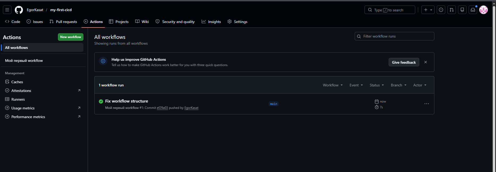

# my-first-cicd

# my-first-cicd

Мой первый CI/CD пайплайн с GitHub Actions.

## Статус сборки

[](https://github.com/YOUR_USERNAME/my-first-cicd/actions/workflows/hello.yml)

## Как это работает

При каждом push в репозиторий автоматически запускается GitHub Actions workflow, который:
1. Клонирует код репозитория
2. Выводит приветствие в консоль

## Локальный запуск (опционально)

```bash
echo "Привет, мир! Я только что запустил CI!"
```

